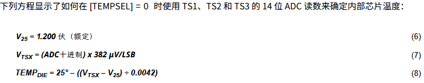
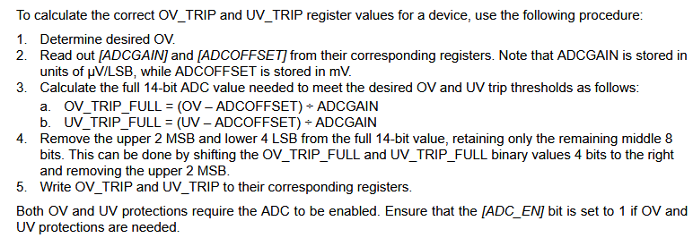

# 开发日记
> 持续更新中...
---
## 简介
本开发日记记录了在开发过程中遇到的问题、解决方法以及开发进度等。

## 问题记录及解决方案
### BMS 开发日记
 1. 电压读取 

    每个电池单元将 在一个50毫秒的抽取窗口内进行测量,并且每250毫秒可获得一次完整更新。 根据芯片手册,充电或空闲时电压读取时间应大于250ms
 
    当连续 5 个电池单元的任意电池单元正在进行均衡时,**受影响的电池单元** 将在缩短的 12.5 毫秒抽取周期内进行测 量,以允许电池均衡正常工作而不影响集成的过压和欠压保护。
    ```
    V(cell) = GAIN x ADC(cell) + OFFSET
    ```
 2. 电流读取

    在始终开启模式下,CC 以 100% 的速率运行,每 250 毫秒获取一次新的读数。每次读数结束时都会设置 CC_ READY 位,该位会将 ALERT 引脚置高,以通知微控制器有新的读数可用。 (**set [CC_EN] = 1**)
    

 3. 温度测量(*已处理*)
    
    要选择热敏电阻测量模式,请设置 [ TEMP_SEL] = 1。
    要选择内部模具温度测量模式,请设置 [ TEMP_SEL] = 0。
    
 
 4. 过压、欠压保护配置(*\*待处理*)   
    
    保护阈值的配置需要反向计算!

 5. 低功耗(*已处理*)
    SHIP 模式是 BQ769x0 支持的基本和最低功耗模式。SHIP 模式会在初次电池组组装和每次上电复位(POR)事件 后自动进入。当设备处于 NORMAL 模式时,主控可以通过特定的 I2C 指令序列让其进入 SHIP 模式。  
    
    在SHIP模式下,只打开最少的模块,包括VSTUP电源和初始启动检测器。从SHIP模式唤醒到NORMAL模式需要将 TS1引脚拉高到大于VBOOT的电压,这会触发设备启动序列。

    要从正常模式进入SHIP模式,必须在SYS_CTRL1寄存器中对[ SHUT_A] 和[ SHUT_B] 位进行两次连续写入特定模式:

        •  Write #1: [SHUT_A] = 0, [SHUT_B] = 1
        •  Write #2: [SHUT_A] = 1, [SHUT_B] = 0
 6. 电池均衡 (*待处理*)
    
    注意:电池均衡使能后需要在均衡结束失能指定电芯均衡,均衡相关函数有修改,注意检查!!!
 7. 系统状态寄存器的特殊配置(*待处理*)(待处理读取后标志位清0)
 
     完整逐段讲解（TI BQ769xx 电池AFE芯片 SYS_STAT 状态寄存器 0x00）
    #### 一、基础表格总览
    寄存器名称：**SYS_STAT**
    寄存器地址：**0x00**
    寄存器8个位：bit7 ~ bit0，复位默认全部为0
    所有位读写属性：RW（可读可写）

    | Bit7 | Bit6 | Bit5 | Bit4 | Bit3 | Bit2 | Bit1 | Bit0 |
    |------|------|------|------|------|------|------|------|
    | CC_READY | RSVD | DEVICE_XREADY | OVRD_ALERT | UV | OV | SCD | OCD |

    #### 关键特殊规则（最重要）
    > 向对应位写**1** → 清零该状态位；
    > 向对应位写**0** → 这一位完全不变，无任何效果。
    这是**锁存型故障标志**典型设计：故障触发后置1锁存，必须软件写1手动清标志，故障消失也不会自动归零。

    #### 四、开发实操要点
    1. **清除故障标志标准写法**
    
        想清除UV、OV故障位，不能写0，要对应bit填1：
     例如清除欠压、过压：
    ```c
    uint8_t stat = ReadReg(0x00);
    stat |= (1 << 3) | (1 << 2); // bit3、bit2写1，清除UV、OV
    WriteReg(0x00, stat);
    ```
    2. RSVD（bit6）绝对不能强制覆盖
    永远采用**读-改-写**，只修改需要操作的功能位，保留bit6原值；
    直接赋值`WriteReg(0,0x00)`会把RSVD强制写0，存在隐患。
    3. 故障是锁存模式
    哪怕电芯恢复正常电压/电流，UV/OV/OCD/SCD这些位依然保持1，必须软件主动写1清零。
    4. CC_READY使用逻辑
    循环读取SYS_STAT，判断bit7=1时，读取CC_HI、CC_LO电量数据，随后写1清除CC_READY标志，等待下一次电量更新。
 
 8. 寄存器位配置等存在问题(*待处理*)
 
## 开发进度
