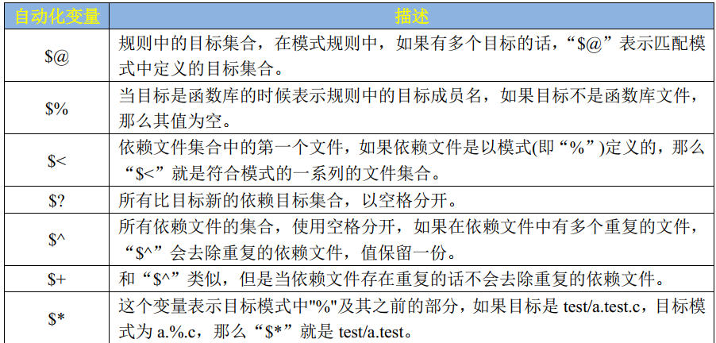

# Linux 嵌入式开发学习

> 专注于嵌入式Linux开发的实战指南 - 持续更新中...

---

## 基础命令

### 文件操作

```bash
ls          # 列出文件
ls -l       # 详细列表格式
ls -a       # 显示所有文件（包括隐藏文件）
ls -lh      # 人性化显示文件大小
cd          # 切换目录
cd ..       # 返回上一级目录
cd ~        # 回到用户主目录
cd -        # 回到上一次所在目录
pwd         # 显示当前路径
cp file1 file2   # 复制文件1到文件2
cp -r dir1 dir2  # 递归复制目录
mv file1 file2   # 移动/重命名文件
rm file     # 删除文件
rm -r dir   # 递归删除目录
rm -f file  # 强制删除（不提示）
mkdir dir   # 创建目录
mkdir -p dir/subdir  # 递归创建多级目录
touch file  # 创建空文件或更新文件时间戳
cat file    # 查看文件内容
cat file1 file2 > file3  # 合并文件1和文件2到文件3
tail file   # 查看文件末尾10行
tail -f file  # 实时查看文件更新
head file   # 查看文件开头10行
less file   # 分页查看文件内容（按q退出）
more file   # 分页查看文件内容
```
## Ubuntu文件系统结构

Ubuntu遵循标准的Linux文件系统层次标准（FHS）。以下是主要目录结构及说明：

```bash
/
├── bin/          # 二进制可执行文件（所有用户可用的基础命令）
├── sbin/         # 系统管理命令（主要供root使用）
├── boot/         # 引导加载程序文件（内核、initrd）
├── dev/          # 设备文件（如/dev/sda、/dev/tty）
├── etc/          # 系统配置文件
├── home/         # 用户主目录（/home/username）
├── lib/          # 共享库文件
├── lib64/        # 64位共享库
├── media/        # 可移动设备挂载点
├── mnt/          # 临时挂载的文件系统
├── opt/          # 可选应用程序软件包
├── proc/         # 虚拟文件系统（进程信息、系统信息）
├── root/         # root用户的主目录
├── run/          # 运行时变量数据（如PID文件）
├── srv/          # 服务相关数据
├── sys/          # 虚拟文件系统（硬件设备信息）
├── tmp/          # 临时文件（重启后清空）
├── usr/          # 用户实用程序和数据
│   ├── bin/      # 用户命令
│   ├── sbin/     # 系统管理命令
│   ├── lib/      # 库文件
│   ├── local/    # 本地安装的软件
│   └── share/    # 共享数据（文档、图标等）
└── var/          # 可变数据（日志、缓存等）
    ├── log/      # 日志文件
    ├── cache/    # 缓存数据
    ├── spool/    # 假脱机数据（邮件、打印任务等）
    └── tmp/      # 临时文件
```

### 常用系统路径说明

```bash
# 查看磁盘分区与挂载点
df -h                    # 以人类可读格式显示磁盘使用情况
lsblk                    # 列出块设备
mount                    # 查看已挂载的文件系统

# 关键配置文件路径
/etc/passwd              # 用户账户信息
/etc/group               # 用户组信息
/etc/fstab               # 文件系统挂载表
/etc/hosts               # 主机名映射
/etc/hostname            # 主机名
/etc/resolv.conf         # DNS配置
/etc/apt/sources.list    # 软件源列表

# 常用日志文件
/var/log/syslog          # 系统日志
/var/log/auth.log        # 认证日志
/var/log/dmesg           # 内核日志
/var/log/apt/history.log # 软件包安装历史

# 查看内核与系统信息
uname -a                 # 查看内核版本及系统架构
cat /proc/version        # 查看详细内核版本信息
cat /proc/cpuinfo        # 查看CPU信息
cat /proc/meminfo        # 查看内存信息
hostname                 # 查看/设置主机名
```

### 文件权限管理

```bash
# 权限表示方式（d rwx r-x r--）
# 第一位：文件类型（d=目录，-=文件，l=链接）
# 后9位：所有者权限 / 组权限 / 其他用户权限
# r=读(4)  w=写(2)  x=执行(1)

ls -l                    # 查看文件权限
chmod 755 file           # 设置权限为rwxr-xr-x
chmod u+x file           # 给文件所有者添加执行权限
chmod g-w file           # 移除组的写权限
chmod o+r file           # 给其他用户添加读权限
chown user:group file    # 修改文件所有者和所属组
chown -R user:group dir  # 递归修改目录权限

# 特殊权限
chmod u+s file           # 设置SUID（以文件所有者身份执行）
chmod g+s dir            # 设置SGID（新创建的文件继承目录所属组）
chmod +t dir             # 设置粘滞位（仅所有者可删除目录内文件）
```

### 链接文件

```bash
# 硬链接（指向同一inode，不能跨分区，不能链接目录）
ln source_file hard_link

# 软链接（符号链接，可跨分区，可链接目录）
ln -s source_file soft_link

# 查看链接指向
ls -l soft_link          # 显示链接指向的目标
readlink soft_link       # 查看符号链接指向
stat file                # 查看文件inode信息
```

### 挂载管理

```bash
# 挂载设备
mount /dev/sdb1 /mnt/data              # 挂载分区到指定目录
mount -t ext4 /dev/sdb1 /mnt/data      # 指定文件系统类型
mount -o rw,remount /mnt/data          # 重新挂载为读写模式

# 卸载设备
umount /mnt/data                       # 卸载挂载点
umount /dev/sdb1                       # 通过设备名卸载

# 开机自动挂载（编辑/etc/fstab）
# /dev/sdb1  /mnt/data  ext4  defaults  0  2
# 格式：设备  挂载点  文件系统  挂载选项  dump  fsck顺序

# 查看块设备UUID（用于fstab中稳定标识）
blkid
ls -l /dev/disk/by-uuid/
```

### 进程与系统监控路径

```bash
# proc文件系统（虚拟文件系统，反映内核运行状态）
/proc/PID/               # 进程PID的详细信息
/proc/PID/status         # 进程状态信息
/proc/PID/maps           # 进程内存映射
/proc/PID/cmdline        # 进程启动命令

# sys文件系统（反映硬件设备和内核参数）
/sys/class/              # 按类别组织的设备
/sys/block/              # 块设备信息
/sys/bus/                # 总线设备信息
/sys/devices/            # 所有设备的层级结构
```

## 嵌入式Linux核心专题

### 1. 交叉编译环境搭建

```bash
# 安装交叉编译工具链
sudo apt-get install gcc-arm-linux-gnueabihf g++-arm-linux-gnueabihf

# 验证工具链
arm-linux-gnueabihf-gcc --version

# 设置环境变量
export ARCH=arm
export CROSS_COMPILE=arm-linux-gnueabihf-
export PATH=$PATH:/path/to/toolchain/bin
#常用命令
arm-linux-gnueabihf-gcc -o myprogram myprogram.c
arm-linux-gnueabihf-ls -l myprogram
arm-linux-gnueabihf-ls - -Ttext myprogram > myprogram.text
arm-linux-gnueabihf-size -A myprogram
```
### Makefile 
#### Makefile 规则格式

    Makefile 里面是由一系列的规则组成的，这些规则格式如下：
    目标…... : 依赖文件集合……
    命令 1
    命令 2
#### Makefile 变量
```bash
    跟 C 语言一样 Makefile 也支持变量的，先看一下前面的例子：
main: main.o input.o calcu.o
gcc -o main main.o input.o calcu.o
    上述 Makefile 语句中， main.o input.o 和 calcue.o 这三个依赖文件，我们输入了两遍，我们
    这个 Makefile 比较小，如果 Makefile 复杂的时候这种重复输入的工作就会非常费时间，而且非常容易输错，为了解决这个问题， Makefile 加入了变量支持。不像 C 语言中的变量有 int、 char等各种类型， Makefile 中的变量都是字符串！类似 C 语言中的宏。使用变量将上面的代码修改，
    示例代码 3.4.2.1 Makefile 变量使用
    1 #Makefile 变量的使用
    2 objects = main.o input.o calcu.o
    3 main: $(objects)
    4 gcc -o main $(objects)
```bash
```
#### Makefile 模式规则
```bash
    模式规则中，至少在规则的目标定定义中要包涵“%”，否则就是一般规则，目标中的“%”表示对文件名的匹配，“%”表示长度任意的非空字符串，比如“%.c”就是所有的以.c 结尾的文件，类似与通配符， a.%.c 就表示以 a.开头，以.c 结束的所有文件,当“%”出现在目标中的时候，目标中“%”所代表的值决定了依赖中的“%”值，使用方法如下：
    %.o : %.c
    gcc -c -o $@ $<
```
#### 自动化变量


# 编译内核模块

make ARCH=arm -j$(nproc) modules

# 编译内核
make ARCH=arm -j$(nproc) uImage

# 编译设备树
make ARCH=arm dtbs
```

### 2. 内核与驱动开发基础

```bash
# 配置内核（基于ARM架构）
make ARCH=arm menuconfig
make ARCH=arm xilinx_zynq_defconfig  # 针对Xilinx Zynq平台

# 编译内核
make ARCH=arm -j$(nproc) uImage
make ARCH=arm -j$(nproc) modules

# 编译设备树
make ARCH=arm dtbs

# 安装模块到根文件系统
make ARCH=arm INSTALL_MOD_PATH=/path/to/rootfs modules_install
```

### 3. 根文件系统构建

```bash
# 使用BusyBox构建最小根文件系统
git clone git://busybox.net/busybox.git
cd busybox
make menuconfig  # 选择静态编译(Build static binary)
make -j$(nproc)
make install CONFIG_PREFIX=/path/to/rootfs

# 创建必要的目录结构
cd /path/to/rootfs
mkdir -p dev proc sys etc etc/init.d lib

# 编写初始化脚本（etc/init.d/rcS）
cat > etc/init.d/rcS << EOF
#!/bin/sh
mount -t proc none /proc
mount -t sysfs none /sys
mount -t devtmpfs none /dev
/sbin/mdev -s
ifconfig eth0 192.168.1.100 netmask 255.255.255.0 up
route add default gw 192.168.1.1
EOF
chmod +x etc/init.d/rcS

# 制作根文件系统镜像
dd if=/dev/zero of=rootfs.ext4 bs=1M count=128
sudo mkfs.ext4 rootfs.ext4
sudo mkdir -p /mnt/rootfs
sudo mount rootfs.ext4 /mnt/rootfs
sudo cp -r /path/to/rootfs/* /mnt/rootfs/
sudo umount /mnt/rootfs
```

### 4. 设备树（Device Tree）操作

```bash
# 查看当前设备树
cat /proc/device-tree/model
cat /proc/device-tree/compatible

# 编译设备树源文件
dtc -I dts -O dtb -o myboard.dtb myboard.dts

# 反编译设备树二进制文件
dtc -I dtb -O dts -o myboard.dts myboard.dtb

# 在U-Boot中指定设备树
setenv bootargs 'console=ttyPS0,115200 root=/dev/mmcblk0p2 rootfstype=ext4 rw'
setenv bootcmd 'mmc dev 0; mmc read 0x00000000 0x1000 0x800; mmc read 0x00A00000 0x1800 0x200; bootz 0x00000000 - 0x00A00000'
saveenv
```

### 5. 系统调试工具

```bash
# 串口调试工具
sudo apt-get install minicom screen
minicom -s  # 配置串口参数（波特率115200，8N1）
screen /dev/ttyUSB0 115200

# 硬件调试
apt-get install gdb-multiarch
arm-linux-gnueabihf-gdb vmlinux  # 内核调试

# 性能分析
perf list  # 查看可用性能事件
perf top -g  # 实时性能分析
perf record -g -p <pid>  # 记录进程性能数据
perf report  # 分析性能数据

# 内存调试
valgrind --leak-check=full ./application  # 用户态内存泄漏检测
cat /proc/meminfo  # 查看内存使用详情
cat /proc/<pid>/maps  # 查看进程内存映射
```

### 6. 嵌入式应用开发

```c
// 示例：LED驱动应用（用户态控制GPIO）
#include <stdio.h>
#include <stdlib.h>
#include <fcntl.h>
#include <unistd.h>
#include <sys/stat.h>

#define GPIO_PATH "/sys/class/gpio/gpio123/"

int main() {
    int fd;
    
    // 导出GPIO
    fd = open("/sys/class/gpio/export", O_WRONLY);
    write(fd, "123", 3);
    close(fd);
    
    // 设置为输出模式
    fd = open(GPIO_PATH "direction", O_WRONLY);
    write(fd, "out", 3);
    close(fd);
    
    // 控制LED闪烁
    fd = open(GPIO_PATH "value", O_WRONLY);
    while(1) {
        write(fd, "1", 1);
        sleep(1);
        write(fd, "0", 1);
        sleep(1);
    }
    close(fd);
    
    // 取消导出GPIO
    fd = open("/sys/class/gpio/unexport", O_WRONLY);
    write(fd, "123", 3);
    close(fd);
    
    return 0;
}
```

```bash
# 交叉编译应用程序
arm-linux-gnueabihf-gcc -o led_control led_control.c -static

# 传输到开发板
scp led_control root@192.168.1.100:/root/

# 在开发板上运行
chmod +x led_control
./led_control
```

### 7. 启动流程分析

```bash
# U-Boot阶段
printenv  # 查看环境变量
version  # 查看U-Boot版本
bdinfo   # 查看板级信息

# 内核启动阶段
cat /proc/cmdline  # 查看内核启动参数
dmesg | head -50  # 查看内核启动日志
dmesg | grep "error\|warn"  # 查找启动错误

# 用户空间初始化
ls -l /etc/init.d/  # 查看初始化脚本
ps aux | grep init  # 查看init进程
cat /etc/inittab    # 查看SysV init配置
```

---

## 嵌入式Shell脚本实战

### 1. 自动测试脚本

```bash
#!/bin/bash
# GPIO功能自动化测试脚本

GPIO_NUM="123"
TEST_COUNT=5

# 导出GPIO
echo $GPIO_NUM > /sys/class/gpio/export
echo "out" > /sys/class/gpio/gpio$GPIO_NUM/direction

echo "Starting GPIO test..."
for ((i=1; i<=TEST_COUNT; i++))
do
    echo "1" > /sys/class/gpio/gpio$GPIO_NUM/value
    echo "Test $i: GPIO set to HIGH"
    sleep 1
    
    echo "0" > /sys/class/gpio/gpio$GPIO_NUM/value
    echo "Test $i: GPIO set to LOW"
    sleep 1
done

# 清理
echo $GPIO_NUM > /sys/class/gpio/unexport
echo "Test completed successfully"
```

### 2. 系统监控脚本

```bash
#!/bin/bash
# 嵌入式系统资源监控脚本

INTERVAL=5
LOG_FILE="system_monitor.log"

echo "System Monitor started at $(date)" > $LOG_FILE

trap "echo 'Monitor stopped at $(date)' >> $LOG_FILE; exit" INT

while true
do
    echo "=== $(date) ===" >> $LOG_FILE
    echo "CPU Usage:" >> $LOG_FILE
    top -bn1 | grep "Cpu(s)" | sed "s/.*, *\([0-9.]*\)%* id.*/\1/" | awk '{print 100 - $1 "% used"}' >> $LOG_FILE
    echo "Memory Usage:" >> $LOG_FILE
    free -m | awk '/Mem:/ {print $3"MB used / "$2"MB total ("$3/$2*100"%)"}' >> $LOG_FILE
    echo "Disk Usage:" >> $LOG_FILE
    df -h / | awk '/\// {print $3" used / "$2" total ("$5")"}' >> $LOG_FILE
    echo "Network Status:" >> $LOG_FILE
    ifconfig eth0 | grep "inet addr" >> $LOG_FILE
    echo >> $LOG_FILE
    
    sleep $INTERVAL
done
```

---

## 高级命令组合技巧

### 1. 批量文件处理

```bash
# 批量交叉编译当前目录下所有C文件
for file in *.c; do
    arm-linux-gnueabihf-gcc -o "${file%.c}" "$file" -static
done

# 批量传输文件到开发板
scp *.bin root@192.168.1.100:/root/

# 批量修改文件权限
find /path/to/binaries -type f -name "*.sh" -exec chmod +x {} \;
```

### 2. 日志分析与过滤

```bash
# 从串口日志中提取内核启动时间
dmesg | grep "Linux version" | awk '{print $3, $4, $5}'

# 统计系统启动过程中的驱动加载情况
dmesg | grep "driver loaded" | wc -l

# 实时监控串口日志中的错误信息
screen /dev/ttyUSB0 115200 | tee serial.log | grep -i "error\|fail\|warn"
```

### 3. 硬件信息采集

```bash
# 采集CPU温度（针对不同平台）
cat /sys/class/thermal/thermal_zone0/temp  # 通用方式
cat /sys/devices/virtual/thermal/thermal_zone0/temp  # ARM平台

# 查看GPIO状态
for gpio in /sys/class/gpio/gpio*
do
    echo "$(basename $gpio): $(cat $gpio/value) ($(cat $gpio/direction))"
done

# 查看SPI设备
ls -l /dev/spidev*
cat /sys/class/spi_master/spi0/device/modalias
```

---

## 常见问题排查

### 1. 启动失败排查流程

```bash
# 检查U-Boot是否正常启动
echo "U-Boot version: $(version)"

# 检查SD卡/MMC设备
mmc list
mmc dev 0
mmc read 0x0 0x100 0x10  # 读取MBR

# 检查内核镜像
md5sum uImage  # 计算镜像MD5值
cmp uImage /dev/mmcblk0p1  # 对比存储中的镜像
```

### 2. 网络问题排查

```bash
# 检查物理连接
ethtool eth0  # 查看网卡状态
mii-tool eth0  # 查看PHY状态

# 检查IP配置
ip addr show eth0
route -n
cat /etc/resolv.conf

# 网络连通性测试
ping -c 3 8.8.8.8
curl -I http://www.baidu.com
```

---

*嵌入式Linux进阶内容持续更新中...*