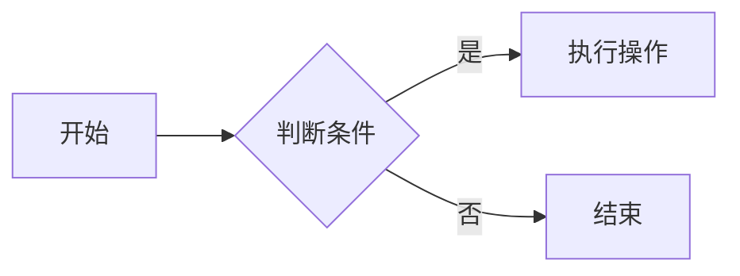

# Markdown 学习笔记
Markdown 是一种轻量级标记语言，通过简单的语法实现文本格式化，广泛应用于文档编写、博客发布、README 文件等场景。以下是详细的 Markdown 语法整理：

## 一、基础语法
### 1. 标题
使用 `#` 表示标题，`#` 数量对应标题级别（1-6级）：
```markdown
# 一级标题
## 二级标题
### 三级标题
#### 四级标题
##### 五级标题
###### 六级标题
```

### 2. 段落与换行
- 直接输入文字即可形成段落，段落之间需要空一行
- 单行换行：在行尾添加两个空格加回车
- 强制换行：使用 `<br>` 标签

### 3. 强调
```markdown
*斜体文本* 或 _斜体文本_
**粗体文本** 或 __粗体文本__
***粗斜体文本*** 或 ___粗斜体文本___
~~删除线文本~~
```

### 4. 列表
#### 无序列表
```markdown
- 项目1
- 项目2
  - 子项目2.1
  - 子项目2.2

* 项目A
* 项目B

+ 项目X
+ 项目Y
```

#### 有序列表
```markdown
1. 第一步
2. 第二步
   1. 子步骤2.1
   2. 子步骤2.2
3. 第三步
```

#### 任务列表
```markdown
- [x] 已完成任务
- [ ] 待完成任务1
- [ ] 待完成任务2
```

## 二、代码与引用
### 1. 代码块
#### 单行代码
```markdown
`console.log('Hello World');`
```

#### 多行代码（带语法高亮）
```javascript
function sayHello() {
  console.log('Hello Markdown!');
}
sayHello();
```

```python
def hello():
    print("Hello Markdown!")
hello()
```

### 2. 引用
```markdown
> 这是一段引用文本
> 可以换行继续写

> 嵌套引用
>> 这是第二层引用
>>> 这是第三层引用
```

## 三、链接与图片
### 1. 链接
#### 普通链接
```markdown
[百度](https://www.baidu.com)
[Google](https://www.google.com "搜索引擎")  <!-- 带标题 -->
```

#### 锚点链接
```markdown
[跳转到标题一](#一基础语法)
```

#### 引用式链接
```markdown
[GitHub][1]
[Twitter][2]

[1]: https://github.com
[2]: https://twitter.com
```

### 2. 图片
```markdown


<!-- 引用式图片 -->
![Logo][logo]
[logo]: https://example.com/logo.png
```

## 四、表格
```markdown
| 姓名 | 年龄 | 职业 |
| ---- | ---- | ---- |
| 张三 | 25 | 工程师 |
| 李四 | 30 | 设计师 |
| 王五 | 28 | 产品经理 |

<!-- 对齐方式 -->
| 左对齐 | 居中对齐 | 右对齐 |
| :----- | :------: | -----: |
| 文本1 | 文本2 | 文本3 |
| 文本4 | 文本5 | 文本6 |
```

## 五、分割线
可以使用以下任意一种方式：
```markdown
---
***
___
```

## 六、特殊符号
```markdown
\* 星号 \*
\# 井号 \#\n\! 感叹号 \!

&copy; 版权符号
&reg; 注册商标
&trade; 商标
```

## 七、扩展语法
### 1. 脚注
```markdown
这是一个带脚注的句子[^1]

[^1]: 这里是脚注的内容
```

### 2. 目录（部分编辑器支持）
```markdown
[TOC]
```

### 3. 数学公式（LaTeX）
```markdown
$E=mc^2$

$$
\int_{a}^{b} f(x) dx
$$
```

### 4. 流程图（部分工具支持）

# 八、支持docsify的插件的添加及使用方式

<!-- tabs:start -->

## **docsify-tabs**

<!-- tabs:start -->

/#### **English**

Hello!

/#### **French**

Bonjour!

/#### **Italian**

Ciao!

<!-- tabs:end -->


#### **待加入**

Bonjour!

#### **待加入**

Ciao!

<!-- tabs:end -->

---
> 持续更新中...