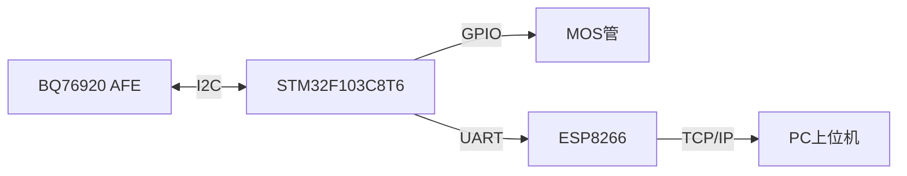
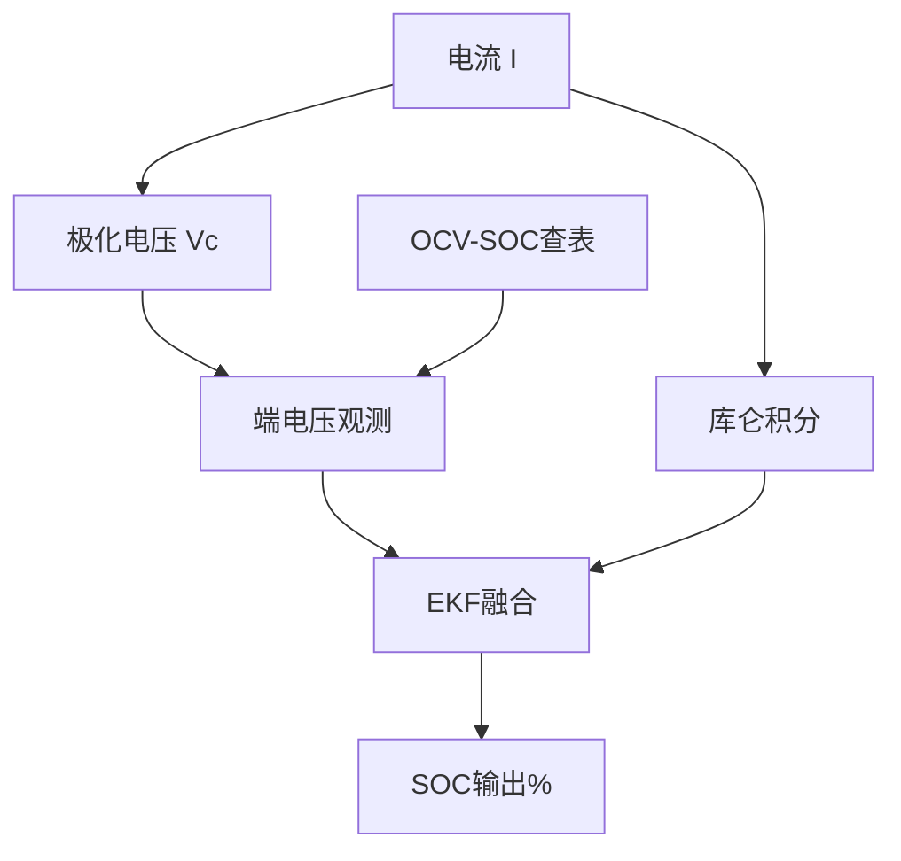

# 从零构建一套 STM32 + FreeRTOS 的锂电池 BMS（含上位机与 EKF 算法）

> 项目开源地址：**[github.com/QingFeng616/Battery-Management-System](https://github.com/QingFeng616/Battery-Management-System)**

## 一、为什么自己做一个 BMS

无论是电动车、储能电站，还是手边的电动工具，只要用到锂电池组，就离不开 **BMS（Battery Management System，电池管理系统）**。它的职责很硬核：实时采集每节电芯的电压/电流/温度、估算剩余电量（SOC）、在异常时切断充放电回路保护电池、并通过均衡让各节电芯"步调一致"。

这个项目是我为了系统练习**嵌入式软件分层架构 + 电池估计算法**而做的完整 5 串锂电池 BMS，硬件基于 **STM32F103C8T6 + FreeRTOS**，前端用 TI 的 **BQ76920**，通信走 **ESP8266 WiFi**，配套一个 **.NET 8 WinForms 上位机**做实时监控。

整套系统的工作流如下：



---

## 二、硬件组成

| 部件 | 型号 | 作用 |
|------|------|------|
| 主控 MCU | STM32F103C8T6 | Cortex-M3 / 72MHz，跑 FreeRTOS，编排采集、保护、均衡、通信等任务 |
| 模拟前端 AFE | TI BQ76920 | 3~5 串锂电监控：单体/总压、电流（库仑计）、温度，并集成充放电 FET 控制与硬件故障检测（过流 OCD / 短路 SCD / 过压 OV / 欠压 UV） |
| WiFi 模块 | ESP8266 | Station 模式，连接路由器后通过 TCP 把数据推送到上位机 |
| 电池组 | 5 串锂离子电池 | 本项目管理对象 |

选用 "Blue Pill" 级别的 STM32F103C8T6，是为了在**成本极低**的前提下，把重心放在软件架构与算法上——它完全够跑这套逻辑。

---

## 三、软件架构：分层 + 可测试

固件代码按职责清晰分层，这也是这个项目最想展示的工程能力：

```text
app/          应用层：FreeRTOS 任务编排（采集 / 均衡 / SOC / 保护 / 通信）
services/     业务服务层：与硬件解耦、可单测（balance / soc / protection / comm / charge_state）
algorithms/   算法层：库仑积分(bq_soc) + EKF(bq_soc_ekf) + 滤波
drivers/      驱动层：BQ76920、ESP8266、串口等外设
bsp/          板级支持：LED / 按键 / OLED / 看门狗
platform/     启动 / 系统时钟 / 链接脚本
rtos/         FreeRTOS 内核与配置
mcu/          MCU 启动文件（CMSIS）
Library/      STM32 标准外设库
tests/        PC 主机单元测试 + Python 参考验证
```

**关键设计**：`services/` 与 `drivers/` 通过明确接口隔离，业务逻辑不读写全局硬件状态。因此 `balance_service` / `soc_service` 无需任何桩件，就能在 PC 上用 `gcc` 直接跑单元测试——算法正确性有自动化守护，而不是"烧进板子看灯亮不亮"。

---

## 四、FreeRTOS 多任务设计

`start_task` 拉起 5 个工作任务，各自周期与职责如下：

| 任务 | 周期 | 职责 |
|------|------|------|
| `SystemMonitor_task` | 1 s | 翻转 LED、喂独立看门狗（IWDG），保证系统存活 |
| `BMS_collect_task` | 500 ms | 读 BQ76920（电流/温度/5 路单体电压/总压）→ IR 压降补偿 → 充放电状态分类 → SOC 更新 |
| `Balance_task` | 2 s | 调 `BalanceService_Run` 算均衡掩码 → 写 BQ76920 开启对应电芯均衡 |
| `Protect_task` | 50 ms | 调 `ProtectionService_Run` 做故障检测与 FET 控制 |
| `Communication_task` | `PC_REPORT_INTERVAL_MS` | 构造 JSON 帧 → 经 ESP8266 发送 → 维持 TCP 链路/断线重连 |

I2C 访问（AFE）与 `printf` 输出分别用 `xI2CMutex` / `xPrintfMutex` 互斥保护，避免多任务抢总线。

---

## 五、核心算法：SOC 估算（库仑积分 + EKF 融合）

SOC（剩余电量百分比）是 BMS 最难也最有趣的部分。本项目用**双估计器融合**：

1. **库仑积分（安时法）** `algorithms/bq_soc.c`：按 `SOC += I·dt/(3600·Q)·100` 对电流积分，静置时用电芯 **OCV-SOC 查表**做开路电压修正，消除零漂累积。
2. **扩展卡尔曼滤波 EKF** `algorithms/bq_soc_ekf.c`：基于**一阶 Thevenin 等效电路**，
   - 状态 `x = [SOC(%), Vc(V)]`（Vc 为极化电压）
   - 过程模型：电流积分预测 SOC，极化电压按 `τ = R1·C1` 指数衰减
   - 观测模型：`V_cell = OCV(SOC) + I·R0 + Vc`
   - EKF 用"电流积分"预测、"端电压 vs OCV"修正，自动权衡两者噪声，给出比单一方法更平滑、抗累积误差的估计。

模型参数集中定义便于调参：`R0=0.030Ω, R1=0.050Ω, C1=1200F (τ≈60s)`。

算法数据流如下：



> 电流符号约定：`I>0 充电 → SOC 升`，`I<0 放电 → SOC 降`。这一约定已用单元测试守护（曾经修过符号反了的 bug）。

---

## 六、保护逻辑：状态机 + FET 控制

保护不是"看到超阈值就断电"这么简单，本项目用一套完整的**保护状态机** `ProtectionService` 管理：

- **状态**：`NORMAL` → `OVERVOLTAGE` / `UNDERVOLTAGE` / `MULTIPLE_UV` / `CURRENT_FAULT` → `RECOVERING`
- **阈值**（可在 `ProtectionService_GetConfig` 调整）：过压 **4200 mV**、欠压 **2700 mV**、**≥3 节**同时欠压触发 `MULTIPLE_UV`（往往意味着采样线故障）、恢复超时 **5 s**
- **优先级**：过流/短路（OCD/SCD）最高，且**需要人工复位**（硬件锁存，避免危险工况下自动恢复）；电压类故障可在电压回稳并维持 5 s 后自动恢复
- **动作**：异常时 `DSG_OFF()` / `CHG_OFF()` 关闭充放电 MOS；正常时确保 FET 开启

这种设计兼顾了**安全性**（危险故障不自动恢复）与**可用性**（瞬时电压波动后能自愈）。

---

## 七、通信协议：紧凑 JSON 帧

固件通过 ESP8266 向上位机周期上报一帧紧凑 JSON 风格数据（字段已对齐真实代码）：

```text
{BMS,"V":19250,"I":1.520,"T":320,"SOC":80.00,
 "C":[3850,3830,3820,3840,3810],"B":0,"H":0,
 "F":00,"DHG":0,"CHG":0,"CharS":0}
```

| 字段 | 含义 |
|------|------|
| `V` | 电池组总电压（mV） |
| `I` | 电流（A），正=充电 / 负=放电 |
| `T` | 温度 ×10（如 320 = 32.0 ℃） |
| `SOC` | 剩余电量（%） |
| `C` | 5 节单体电压数组（mV） |
| `B` | 均衡掩码 |
| `H` | 热管理状态 |
| `F` | 故障状态寄存器（十六进制） |
| `DHG` / `CHG` | 放电 / 充电 MOS 状态 |
| `CharS` | 充放电状态（0 空闲 / 1 充电 / 2 放电） |

> WiFi 的 SSID / 密码 / 服务器 IP 在 `drivers/esp8266.h` 中配置，仓库内已改为占位符，烧录前需填入真实信息；上报端口可配置。

---

## 八、上位机：.NET 8 WinForms 实时监控

上位机负责把冷冰冰的数据变成**看得见的画面**：

- `SerialService`：串口通信
- `TcpService`：TCP 服务端，接收 ESP8266 推送的 JSON（默认监听端口可配置）
- `BMSDataModel` / `SOCPoint`：数据模型与曲线采样点
- `Form1`：主界面，实时显示总压/电流/温度/SOC、5 路电芯电压柱状或曲线、均衡与故障状态、报警提示

（实际运行截图可替换此处。）

---

## 九、如何获取与运行

```bash
git clone https://github.com/QingFeng616/Battery-Management-System.git
```

- **固件**：用 Keil uVision 打开 `BMS.uvprojx`，选器件 STM32F103C8T6，编译下载。
- **上位机**：用 Visual Studio / `dotnet` 打开 `上位机/BMS.csproj` 运行（需 .NET 8）。
- **自动化测试（无需硬件）**：

  ```bash
  # C 单元测试（gcc 直接编译算法与 service 层）
  gcc -std=c99 -I.. -I../algorithms -I../services -I../drivers -I../app \
      -I. -I./pc_stubs test_main.c test_balance_service.c \
      test_bq_soc_ekf.c test_soc_service.c \
      ../algorithms/bq_soc.c ../algorithms/bq_soc_ekf.c \
      ../services/soc_service.c ../services/balance_service.c \
      -o bms_tests -lm && ./bms_tests

  # Python 参考验证（零依赖，交叉校验）
  python tests/reference/validate.py
  ```

---

## 十、总结与展望

这个项目把**嵌入式分层架构、RTOS 任务调度、AFE 驱动、状态机保护、EKF 估计算法、WiFi 通信、上位机可视化**串成了一条完整链路，每一层都能独立测试和演进。

后续想继续打磨的方向：

- 被动均衡 → **主动均衡**，降低能量损耗；
- 支持更多串数、加 **BLE / 网页仪表盘**；
- SOC 算法加入温度补偿与老化（SOH）估计；
- 上位机增加历史回放与导出。

如果你也在做电池管理或嵌入式架构相关的事，欢迎到仓库提 Issue / PR 交流 👉 **[Battery-Management-System](https://github.com/QingFeng616/Battery-Management-System)**