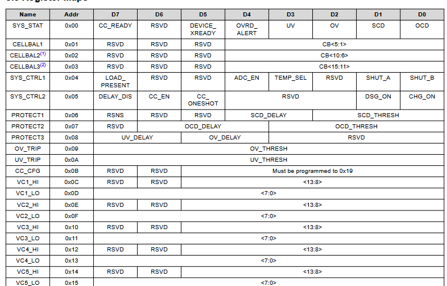
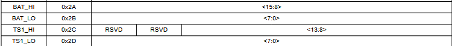
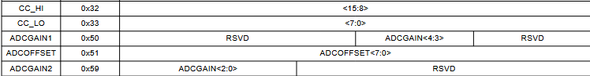

# BMS 电池管理系统

> Battery Management System — 设计与实现

---

## 项目概述

BMS（Battery Management System）是电池管理系统的简称，主要用于监测和管理电池组的工作状态。

## 功能模块

| 模块 | 功能 |
|------|------|
| **电压采集** | 监测单体电池电压 |
| **电流采集** | 监测充放电电流 |
| **温度采集** | 监测电池温度 |
| **SOC 估算** | 估算电池剩余电量 |
| **均衡管理** | 电池一致性管理 |
| **保护功能** | 过充/过放/过温/短路保护 |

## 技术方案

- **MCU**：待定
- **通信协议**：CAN / I2C / SPI
- **采样芯片**：待定

## 寄存器映射



## 芯片上电流程
BQ76920初始化流程总结
1. 硬件上电与启动阶段
```
电源准备：​

确保BAT引脚电压在6-25V范围内（BQ76920）
确保REGSRC引脚电压在6-25V范围内，为LDO供电
等待LDO输出稳定（REGOUT引脚提供2.5V或3.3V，取决于型号）

启动设备：​

设备上电后默认进入SHIP模式（最低功耗模式）
需要通过TS1引脚提供BOOT信号：电压>300mV且<1000mV，持续时间10-2000µs
等待启动完成：tBOOTREADY = 10ms，然后tI2CSTARTUP = 1ms后I2C通信才可用

2. I2C通信初始化
基本配置：​

使用100kHz I2C时钟频率
BQ76920的I2C地址为0x08（默认，具体看型号）
确保SDA和SCL引脚连接正确，有适当的上拉电阻

等待时间：​

从SHIP模式进入NORMAL模式后，需要等待250ms才能读取初始的电池电压数据

3. 寄存器配置步骤
步骤1：清除系统状态寄存器（0x00 SYS_STAT）​

读取SYS_STAT寄存器，检查是否有故障状态
如果有故障位被设置，写入"1"来清除相应位
特别注意清除DEVICE_XREADY、OV、UV、SCD、OCD等故障位

步骤2：配置CC_CFG寄存器（0x0B）​

写入0x19以获得最佳性能

步骤3：配置保护参数寄存器
a. 过流/短路保护（PROTECT1 - 0x06）​

RSNS位：根据电流检测电阻值选择阈值范围（0=低范围，1=高范围）
SCD_D1:0：短路延迟设置（70µs, 100µs, 200µs, 400µs）
SCD_T2:0：短路阈值设置（RSNS=0时22-100mV，RSNS=1时44-200mV）

b. 过流保护（PROTECT2 - 0x07）​

OCD_D2:0：过流延迟设置（8ms, 20ms, 40ms, 80ms, 160ms, 320ms, 640ms, 1280ms）
OCD_T3:0：过流阈值设置（RSNS=0时8-50mV，RSNS=1时17-100mV）

c. 过压/欠压保护（PROTECT3 - 0x08）​

UV_D1:0：欠压延迟设置（1s, 4s, 8s, 16s）
OV_D1:0：过压延迟设置（1s, 2s, 4s, 8s）

d. 过压/欠压阈值（OV_TRIP - 0x09, UV_TRIP - 0x0A）​

需要根据ADC的GAIN和OFFSET值计算：

读取ADCGAIN（0x50, 0x59）和ADCOFFSET（0x51）寄存器
计算OV_TRIP_FULL = (OV - ADCOFFSET) ÷ ADCGAIN
计算UV_TRIP_FULL = (UV - ADCOFFSET) ÷ ADCGAIN
从14位值中提取中间8位，写入OV_TRIP和UV_TRIP寄存器


步骤4：配置系统控制寄存器
a. SYS_CTRL1（0x04）​

ADC_EN = 1：启用ADC（必须启用才能使用OV/UV保护）
TEMP_SEL：选择温度源（0=内部芯片温度，1=外部热敏电阻）
SHUT_A和SHUT_B保持为0（除非要进入SHIP模式）

b. SYS_CTRL2（0x05）​

DELAY_DIS = 0：启用保护延迟（测试时可设为1禁用延迟）
CC_EN：库仑计数器使能（0=禁用，1=连续模式）
CC_ONESHOT：单次测量触发（仅当CC_EN=0时有效）
DSG_ON = 0：放电FET初始关闭
CHG_ON = 0：充电FET初始关闭

步骤5：清除电池平衡寄存器（可选）​

CELLBAL1（0x01）：所有位设为0，禁用电池平衡
注意：相邻电池不能同时平衡

4. 功能启用与监控
启用测量功能：​

等待至少250ms让ADC完成第一次测量
读取电池电压寄存器（VC1_HI/LO到VC5_HI/LO）
读取温度寄存器（TS1_HI/LO）
读取总电压寄存器（BAT_HI/LO）
读取库仑计数器（CC_HI/LO，如果启用）

启用保护功能：​

一旦ADC启用（ADC_EN=1），OV/UV保护自动生效
OCD和SCD保护在NORMAL模式下始终运行

启用FET控制：​

当确认系统状态正常后，可设置：

DSG_ON = 1：启用放电FET
CHG_ON = 1：启用充电FET
```

```
5. 中断处理配置

ALERT引脚配置：​

ALERT引脚需要外部500kΩ-1MΩ下拉电阻
可配置RC滤波器（500kΩ+470pF，时间常数<250µs）
ALERT引脚状态反映SYS_STAT寄存器的OR结果

中断处理流程：​

ALERT引脚变高时，读取SYS_STAT寄存器
确定故障类型（OV, UV, OCD, SCD, CC_READY等）
写入"1"清除相应的状态位
根据故障类型采取相应措施（如关闭FETs）

6. 关键时间参数

启动时间：TS1信号后10ms + 1ms I2C等待
首次电压读取：进入NORMAL模式后250ms
电压更新周期：250ms
温度更新周期：2秒
库仑计数器周期：250ms（连续模式）

7. 错误处理与恢复
常见故障处理：​

DEVICE_XREADY：内部芯片故障，等待几秒后清除
保护故障（OV/UV/OCD/SCD）：检查条件，清除状态位
ALERT覆盖故障：检查外部保护器

恢复流程：​

清除SYS_STAT中的故障位
重新配置保护参数（如果需要）
重新启用FETs（如果之前被禁用）
```
## 开发进度

- [ ] 需求分析与方案设计
- [ ] 硬件选型与原理图设计
- [ ] PCB 设计与制作
- [ ] 固件开发
- [ ] 调试与测试

---

*项目持续更新中...*
