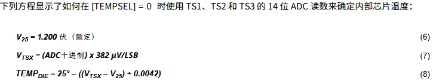
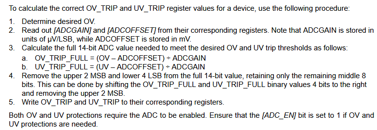
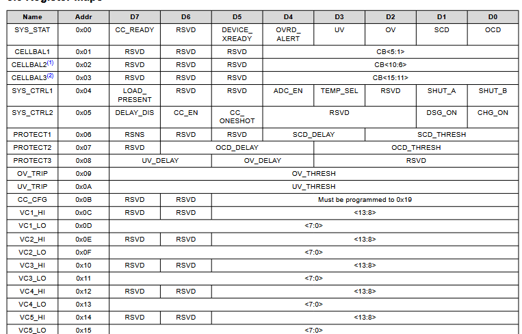
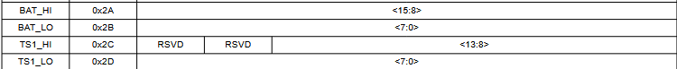
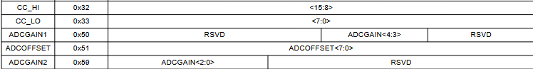

# BMS 电池管理系统

> 基于 TI BQ76920 系列芯片的 3~5 串锂电池智能管理系统 — 从硬件设计到固件开发的完整实践

---

## 项目简介

本项目设计并实现了一套面向 **5 串锂电池组** 的智能电池管理系统（BMS），核心采用 TI 公司 BQ76920 系列模拟前端（AFE）芯片，搭配 STM32 主控 MCU，实现对电池组电压、电流、温度等关键参数的实时监测与智能保护。

| 项目属性 | 详情 |
|----------|------|
| **核心芯片** | TI BQ7692003PWR（AFE） |
| **主控 MCU** | STM32F103  系列 |
| **通信协议** | I2C（Mbus），100kHz，带 CRC-8 校验 |
| **电池规格** | 5 串锂离子 / 磷酸铁锂电池 |
| **采样精度** | 14-bit ADC，377μV/LSB |
| **保护功能** | 过压 / 欠压 / 过流 / 短路 / 过温 |

---

## 系统架构

```
┌─────────────────────────────────────────────────────┐
│                      BMS 系统架构                     │
├───────────────┬───────────────┬─────────────────────┤
│   BQ76920 AFE │    STM32 MCU  │     外部接口         │
│   ─────────   │   ─────────   │    ─────────         │
│  • 电压采集   │  • SOC 估算   │  • 充电 MOS 控制     │
│  • 电流采集   │  • 均衡策略   │  • 放电 MOS 控制     │
│  • 温度监测   │  • 故障处理   │  • 状态指示灯        │
│  • 硬件保护   │  • 通信管理   │  • 外部通信接口      │
│  • 库仑计数   │  • 数据记录   │  • 电池输出端子      │
└───────────────┴───────────────┴─────────────────────┘
```

---

## 核心功能模块

### 1. 电压采集与监测

- **采样机制**：每个电池单元在 50ms 抽取窗口内测量，每 250ms 完成一次完整更新
- **均衡模式**：当电池均衡开启时，受影响电芯的采样周期缩短至 12.5ms
- **电压换算公式**：

```
V(cell) = GAIN × ADC(cell) + OFFSET
```

> GAIN 和 OFFSET 为芯片出厂校准参数，存储在 ADCGAIN1（0x50）、ADCGAIN2（0x51）、ADCOFFSET（0x52）寄存器中

### 2. 电流采集与库仑计数

- **库仑计数器（CC）**：集成 16 位电荷累加器，250ms 更新间隔
- **工作模式**：连续模式（CC_EN = 1），100% 速率运行
- **数据就绪通知**：每次读数完成后，CC_READY 位自动置 1，ALERT 引脚拉高通知 MCU 读取

### 3. 温度监测

- **外部测温**：支持 10kΩ NTC 103AT 热敏电阻（TS1 引脚），内部集成 10kΩ 上拉至 3.3V
- **内部测温**：芯片内置温度传感器（TEMP_SEL = 0）
- **更新周期**：温度数据每 2 秒更新一次，切换测温源时有 2 秒延迟



### 4. 保护机制

| 保护类型 | 触发条件 | 响应动作 | 恢复方式 |
|----------|---------|---------|---------|
| **过压保护（OV）** | 单节电压 > OV_TRIP 阈值 | 自动关闭 CHG FET | 软件清除 OV 标志位 |
| **欠压保护（UV）** | 单节电压 < UV_TRIP 阈值 | 自动关闭 DSG FET | 软件清除 UV 标志位 |
| **过流保护（OCD）** | 放电电流 > OCD 阈值 | 自动关闭 DSG FET | 软件清除 OCD 标志位 |
| **短路保护（SCD）** | 放电电流 > SCD 阈值 | 立即关闭 DSG FET | 软件清除 SCD 标志位 |
| **过温保护** | 温度超出设定范围 | 关闭 CHG/DSG FET | 温度恢复正常后清除 |



### 5. 电池均衡管理

- **均衡方式**：被动均衡（通过 CELLBAL 寄存器控制内部旁路 MOSFET）
- **关键约束**：**相邻电池单元不可同时均衡**，否则均衡功能失效
- **解决方案**：采用奇偶分组策略，奇数电芯和偶数电芯分时均衡

### 6. 低功耗模式

- **SHIP 模式**：芯片支持的最低功耗模式，首次组装和每次上电复位后自动进入
- **进入方式**：通过 SYS_CTRL1 寄存器连续两次特定写入
  - 写入 #1：[SHUT_A] = 0, [SHUT_B] = 1
  - 写入 #2：[SHUT_A] = 1, [SHUT_B] = 0
- **唤醒方式**：TS1 引脚拉高至 >VBOOT（约 1V），触发启动序列

---

## 寄存器映射







---

## 核心寄存器详解

### SYS_STAT（0x00）— 系统状态寄存器

| Bit7 | Bit6 | Bit5 | Bit4 | Bit3 | Bit2 | Bit1 | Bit0 |
|------|------|------|------|------|------|------|------|
| CC_READY | RSVD | DEVICE_XREADY | OVRD_ALERT | UV | OV | SCD | OCD |

> ⚠️ **关键规则**：写 1 清零，写 0 无效。这是锁存型故障标志 —— 即使故障条件消失，标志位也不会自动清零，必须软件主动写 1 清除。

**标准清除故障写法**：

```c
uint8_t stat = ReadReg(0x00);       // 读取当前状态
stat |= (1 << 3) | (1 << 2);       // bit3(UV)、bit2(OV) 写 1 清除
WriteReg(0x00, stat);               // 写回寄存器
```

> ⚠️ **注意**：RSVD（bit6）必须保留原值，采用「读-改-写」方式操作，禁止直接赋值覆盖。

---

## 芯片上电初始化流程

### 第一阶段：硬件上电与启动

1. **电源准备**：确保 BAT 引脚电压在 6~25V 范围内，REGSRC 引脚电压正常
2. **等待 LDO 稳定**：REGOUT 引脚输出 2.5V / 3.3V（视型号而定）
3. **启动设备**：设备上电默认进入 **SHIP 模式**（最低功耗）
4. **BOOT 唤醒**：TS1 引脚施加电压 >300mV 且 <1000mV，持续 10~2000µs
5. **等待就绪**：tBOOTREADY = 10ms → tI2CSTARTUP = 1ms → I2C 通信可用

### 第二阶段：I2C 通信初始化

- 通信速率：100kHz（标准模式）
- 设备地址：0x08（7 位）→ 写地址 0x10，读地址 0x11
- 首次电压读取：进入 NORMAL 模式后需等待 **250ms**

### 第三阶段：寄存器配置序列

| 步骤 | 寄存器 | 操作 | 说明 |
|------|--------|------|------|
| 1 | SYS_STAT（0x00） | 读取并清除所有故障位 | 确保系统状态干净 |
| 2 | CC_CFG（0x0B） | 写入 0x19 | 获得最佳性能 |
| 3 | PROTECT1（0x06） | 配置 SCD 延迟和阈值 | 短路保护参数 |
| 4 | PROTECT2（0x07） | 配置 OCD 延迟和阈值 | 过流保护参数 |
| 5 | PROTECT3（0x08） | 配置 OV/UV 延迟 | 过压/欠压延迟时间 |
| 6 | OV_TRIP（0x09） | 写入过压阈值 | 需根据 GAIN/OFFSET 反向计算 |
| 7 | UV_TRIP（0x0A） | 写入欠压阈值 | 需根据 GAIN/OFFSET 反向计算 |
| 8 | SYS_CTRL1（0x04） | ADC_EN = 1, TEMP_SEL = 1 | 启用 ADC 和外部测温 |
| 9 | SYS_CTRL2（0x05） | CC_EN = 1, DELAY_DIS = 0 | 启用库仑计数 |

### 第四阶段：保护阈值反向计算

```
OV_TRIP_FULL = (OV_target - ADCOFFSET) ÷ ADCGAIN
UV_TRIP_FULL = (UV_target - ADCOFFSET) ÷ ADCGAIN
```

从 14 位计算值中提取中间 8 位写入 OV_TRIP / UV_TRIP 寄存器。

### 第五阶段：FET 使能

```c
// 确认系统状态正常后启用 FET
SYS_CTRL2 |= (1 << DSG_ON_BIT);  // 启用放电 FET
SYS_CTRL2 |= (1 << CHG_ON_BIT);  // 启用充电 FET
```

---

## ALERT 中断处理

### 引脚配置

| 参数 | 规格 |
|------|------|
| 输出类型 | 漏极开路（Open-Drain） |
| 有效电平 | 高电平有效 |
| 下拉电阻 | 500kΩ ~ 1MΩ 到 GND |

> ⚠️ ALERT 引脚电平 = SYS_STAT 所有位的逻辑 OR 结果。**必须先清除 SYS_STAT 中的报警位，ALERT 引脚才会恢复低电平。**

### 中断处理流程

```c
void ALERT_IRQHandler(void)
{
    uint8_t sys_stat = BQ_ReadReg(0x00);

    if (sys_stat & 0x04) Handle_OverVoltage();   // OV
    if (sys_stat & 0x02) Handle_UnderVoltage();  // UV
    if (sys_stat & 0x08) Handle_ShortCircuit();  // SCD
    if (sys_stat & 0x10) Handle_OverCurrent();   // OCD

    BQ_WriteReg(0x00, sys_stat);  // 写 1 清除已处理标志位
}
```

### 故障 FET 响应速查表

| 故障类型 | CHG FET | DSG FET |
|----------|:-------:|:-------:|
| OV（过压） | ❌ 关闭 | 不变 |
| UV（欠压） | 不变 | ❌ 关闭 |
| OCD（过流） | 不变 | ❌ 关闭 |
| SCD（短路） | 不变 | ❌ 关闭 |
| OVRD_ALERT | ❌ 关闭 | ❌ 关闭 |
| DEVICE_XREADY | ❌ 关闭 | ❌ 关闭 |
| CC_READY | 不变 | 不变 |

---

## 关键时间参数汇总

| 参数 | 时间 | 说明 |
|------|------|------|
| 启动时间 | 10ms + 1ms | TS1 唤醒信号后 I2C 可用 |
| 首次电压读取 | 250ms | 进入 NORMAL 模式后等待 |
| 电压更新周期 | 250ms | 正常模式 |
| 均衡模式电压更新 | 12.5ms | 受影响电芯 |
| 温度更新周期 | 2s | TS1 / TS2 |
| 库仑计数器周期 | 250ms | 连续模式 |

---

## 开发进度

- [x] 需求分析与方案设计
- [x] 硬件选型与原理图设计
- [x] 通信协议研究与验证（I2C + CRC-8）
- [x] 电压 / 电流 / 温度采集驱动
- [x] 过压 / 欠压 / 过流 / 短路保护配置
- [x] 电池均衡策略实现
- [x] 低功耗 SHIP 模式
- [x] ALERT 中断处理
- [ ] SOC 算法优化（卡尔曼滤波）
- [ ] 上位机通信接口（CAN / UART）
- [ ] 整机联调与可靠性测试

---

*项目持续更新中，欢迎交流讨论！*